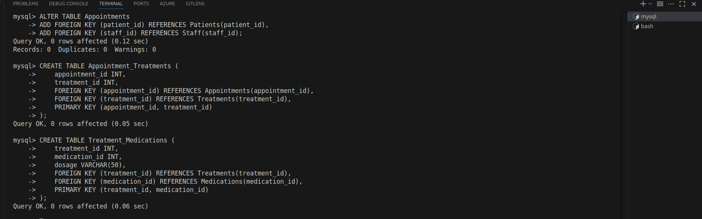
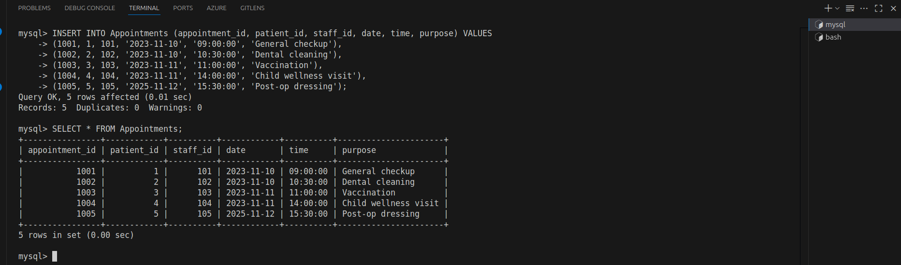
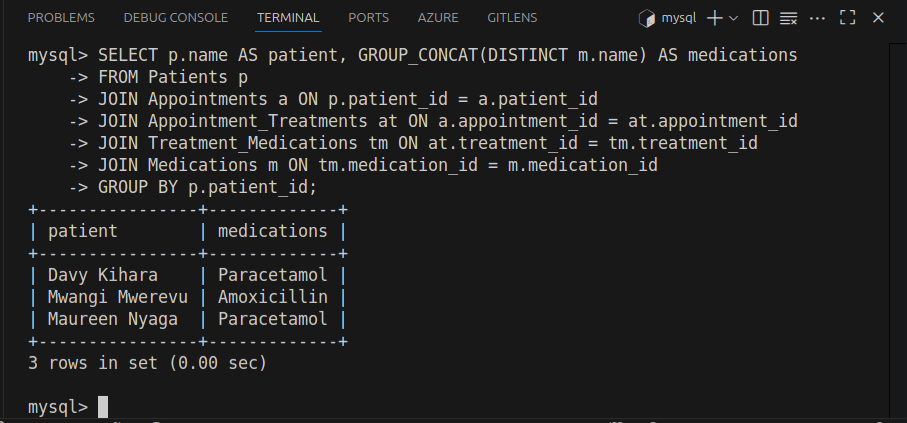

## Database Systems

This assignment involves practical tasks using the MySQL command-line interface to demonstrate understanding of core database concepts. The tasks include creating and managing databases, identifying entities and relationships for a medical center system, designing tables, adding primary keys, enforcing relationships, populating tables with data, and running SQL commands for updating, deleting, and querying relational data. All steps are supported with screenshots as required.

1. A command showing all databases on the system.

1. Create a database and give it your name.

4. Laikipia University Medical Center Database Design.
   i. Entities:

    - Patients
    - Staff
    - Appointments
    - Treatments
    - Medications

ii. Attributes for each entity:

- Patients: patient_id, name, dob, gender, contact, patient_type (student/staff/visitor)
- Staff: staff_id, name, specialization, contact, hire_date
- Appointments: appointment_id, patient_id, staff_id, date, time, purpose
- Treatments: treatment_id, name, description, cost
- Medications: medication_id, name, dosage, stock_quantity

iii. Relationships:
- Patients have many Appointments (1:M)
- Staff have many Appointments (1:M)
- Appointments may have many Treatments (M:M) - needs junction table
- Treatments may involve many Medications (M:M) - needs junction table

iv. Use a command to display each table’s structure

 - Patients table
 

- Staffs table 

- Appointments table
  

- Treatments table
  

- Medications table
  

v. For each table, identify the primary key. Use a command to alter the table so as to add a primary key to the table

- Altered Patients table
    

- Altered Staff table
    

- Altered Appointments table
    

- Altered Treatments table
    

- Altered Medications table
    

vi. For each relationship identified in (iii) above, run commands to create the relationship in the database.

  ## Add foreign keys to Appointments and create junction tables for many to many relationships

  

## Show affected tables

  

  

  

  vii. Populate the tables with appropriate entries. Each table should have at least 5 rows.Take a screenshot of each table showing the data entered. [5 marks]

    - Patients table
- 

    - Staff table
- 
     
    - Appointments table
- 
  
    - Treatments table
- 
  
    - Medications table
- 
 
 Juction tables (Appointment_Treatments and Treatment_Medications)
  
- 

viii. Run at least 5 commands to show how you would update data in the table. Take
a screenshot of each command and also the result of the command. [5 marks]

- 1. Update patient contact
  
    

- 2. Change appointment time
  - 
  
- 3. Increase medication stock
    

- 4. Change staff specialization
     

- 5. Update treatment cost
  - 

ix. Run at least 5 commands to show how to delete data from a table. Take a screenshot of each command and the result of the command. [5 marks]

-- 1. Delete a patient

-- 2. Remove an appointment

  

-- 3. Delete a medication

-- 4. Remove a treatment

-- 5. Delete staff member

-

x. For each relationship between two tables in the database, write at least two different commands to show how a join query can be used to fetch data between two related tables simultaneously. Take a screenshot of the query and the output [10 marks]

-- 1. Patients with their appointments

-- 2. Staff with their appointments

-- 3. Appointments with treatments

-- 4. Treatments with medications

-- 5. Patients with their prescribed medications

